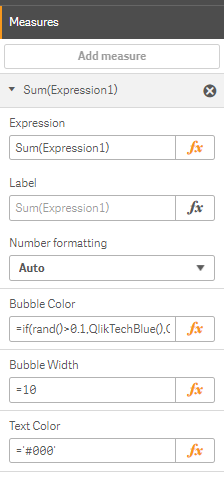
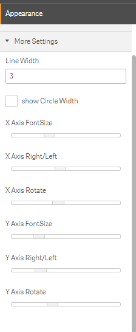
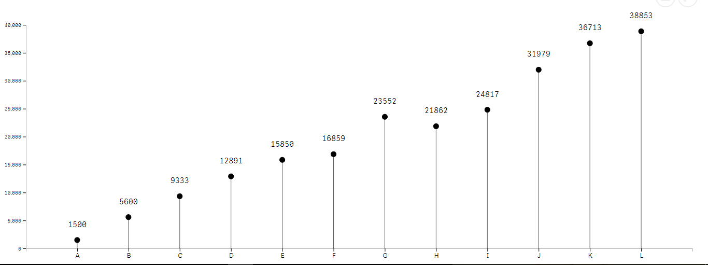
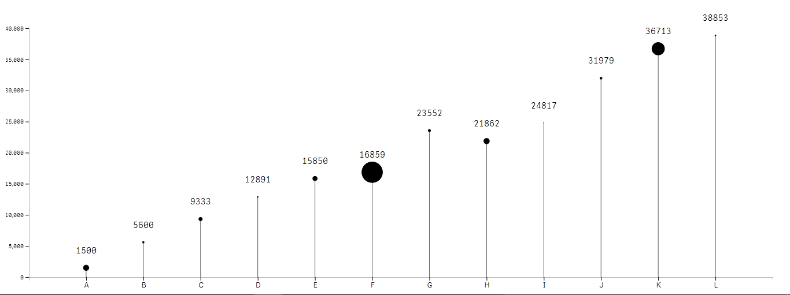
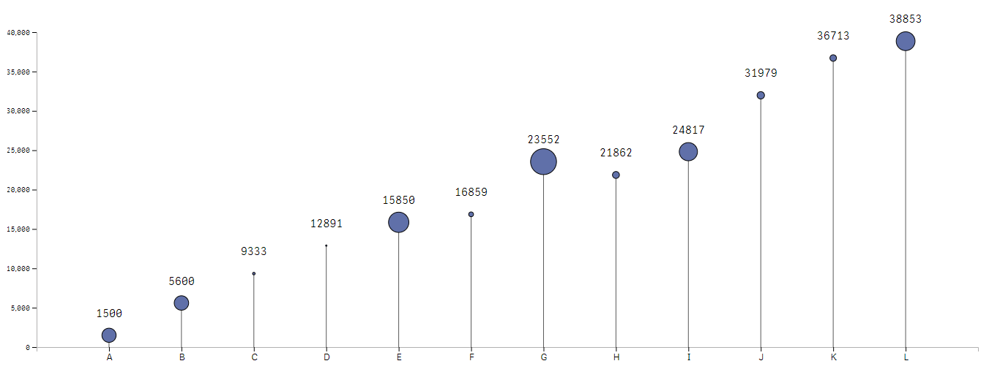
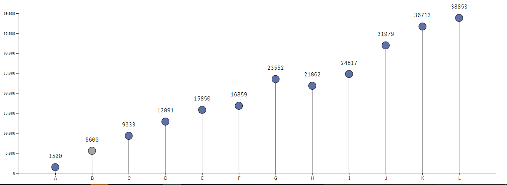
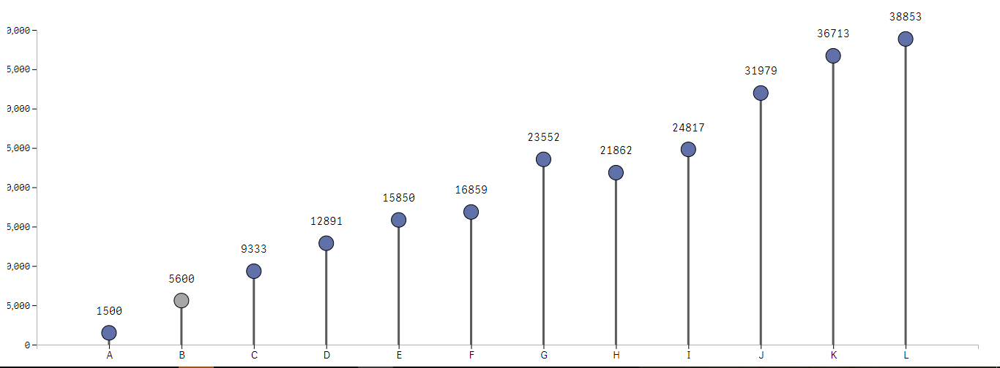

# Qlik Sense Extension - Lollipop Chart
##### This extension creates a Lollipop chart.

Implementation The chart takes 1 dimensions and 1 measures:

#### Dimension 1:
This dimension is for the x-axis.
#### Measure 1:
This measure allows you to define a custom color & background color for bubble as per calculation
#### Measure 1 (optional):
the bubble size & color, Text size can be changes as per requirment.

#### Note :
 More styling option is available in appearance tab
 

